# device_systems

API REST desarrollada con **FastAPI** para la gestión del recurso **users**. Este proyecto es la evolución de la actividad anterior (Clase 7 – Fundamentos de FastAPI) hacia una API con **CRUD completo**, manejo profesional de errores, códigos de estado correctos, documentación Swagger/OpenAPI mejorada y **Dependency Injection** con `Depends()` (Clase 8 – FastAPI Intermedio).

## 1. Descripción de la aplicación

`device_systems` administra usuarios de un sistema, permitiendo:

- Listar usuarios, con filtros opcionales por **rol** y **estado activo**.
- Consultar, **crear**, **actualizar (total y parcialmente)** y **eliminar** usuarios.
- Validación automática de datos con **Pydantic v2**.
- Respuestas estandarizadas que ocultan campos internos (`internal_notes`).
- Manejo de errores explícito: usuario no encontrado, correo duplicado, rol no permitido, actualización sin datos, eliminación de usuario inexistente.
- Reutilización de lógica común mediante **Dependency Injection**.

## 2. Tecnologías utilizadas

- **FastAPI** — framework web para construir la API.
- **Uvicorn** — servidor ASGI que ejecuta la aplicación.
- **Pydantic v2** — validación y serialización de datos.
- **email-validator** — validación de formato de correo electrónico.

## 3. Estructura del proyecto

```
device_systems/
│── app/
│   │── main.py                     # Punto de entrada, middleware, metadatos OpenAPI
│   │── routes/
│   │   └── user_routes.py          # Definición de endpoints (sin lógica de negocio)
│   │── schemas/
│   │   └── user_schema.py          # Modelos Pydantic de entrada y salida
│   │── services/
│   │   └── user_service.py         # Lógica de negocio (crear, listar, actualizar, borrar)
│   │── dependencies/
│   │   └── user_dependencies.py    # Funciones reutilizables con Depends()
│   │── data/
│   │   └── users_db.py             # Simulación de base de datos en memoria
│── requirements.txt
│── README.md
```

**¿Por qué esta separación?**
- `routes` solo traduce HTTP ↔ Python: recibe la petición y llama a `services`.
- `services` contiene las reglas de negocio (por ejemplo, qué significa "correo duplicado"), independientes de si vienen de una petición HTTP o de otro lugar.
- `dependencies` centraliza validaciones repetidas (buscar usuario por ID, verificar una API key) para no reescribirlas en cada endpoint.
- `data` aísla el almacenamiento en memoria para que ninguna otra capa dependa directamente de cómo se guardan los datos.

## 4. Instalación de dependencias

```bash
cd device_systems
python -m venv venv
venv\Scripts\Activate.ps1        # Windows
# source venv/bin/activate       # Linux / macOS
pip install -r requirements.txt
```

## 5. Ejecución del servidor

```bash
uvicorn app.main:app --reload
```

- API: `http://127.0.0.1:8000`
- Swagger UI: `http://127.0.0.1:8000/docs`
- ReDoc: `http://127.0.0.1:8000/redoc`

> El proyecto incluye 3 usuarios de ejemplo precargados (`id` 1, 2 y 3).

## 6. Tabla de endpoints

| Método | Endpoint            | Descripción                          | Código éxito | Código error                     |
|--------|----------------------|----------------------------------------|---------------|------------------------------------|
| GET    | `/`                   | Estado de la API                      | 200           | —                                   |
| GET    | `/users`              | Lista usuarios (filtros `role`, `is_active`) | 200    | —                                   |
| GET    | `/users/{user_id}`    | Consulta un usuario por ID             | 200           | 404 si no existe                   |
| POST   | `/users`              | Crea un usuario                        | 201           | 400 correo duplicado · 422 datos inválidos |
| PUT    | `/users/{user_id}`    | Reemplaza TODOS los campos del usuario | 200           | 404 no existe · 400 correo duplicado · 422 datos inválidos |
| PATCH  | `/users/{user_id}`    | Modifica solo los campos enviados      | 200           | 404 no existe · 400 sin campos o correo duplicado |
| DELETE | `/users/{user_id}`    | Elimina un usuario (requiere header `X-API-Key`) | 200 | 404 no existe · 401 API Key inválida |

## 7. Ejemplos de peticiones y respuestas

### PUT /users/{user_id} — reemplazo completo

**Request:**
```
PUT http://127.0.0.1:8000/users/1
Content-Type: application/json

{
  "name": "Alejandro Murillo",
  "email": "alejandro@device-systems.com",
  "role": "admin",
  "is_active": false
}
```

**Response (200):**
```json
{
  "id": 1,
  "name": "Alejandro Murillo",
  "email": "alejandro@device-systems.com",
  "role": "admin",
  "is_active": false
}
```

Si falta cualquiera de los 4 campos, responde **422** (Pydantic los exige todos en `UserUpdate`).

### PATCH /users/{user_id} — actualización parcial

**Request:**
```
PATCH http://127.0.0.1:8000/users/2
Content-Type: application/json

{
  "role": "support"
}
```

**Response (200):** el usuario completo, con solo el `role` cambiado; el resto de sus campos quedan intactos.

**Si se envía un body vacío `{}`:**
```json
{
  "detail": "Debe enviar al menos un campo para actualizar"
}
```
→ **400 Bad Request**

### DELETE /users/{user_id}

**Request:**
```
DELETE http://127.0.0.1:8000/users/3
X-API-Key: device_systems_key
```

**Response (200):**
```json
{
  "detail": "Usuario con id 3 eliminado correctamente"
}
```

**Sin la cabecera `X-API-Key` o con una clave incorrecta:**
```json
{
  "detail": "API Key inválida o no proporcionada"
}
```
→ **401 Unauthorized**

> La clave de prueba usada en este proyecto académico es `device_systems_key`. En Thunder Client debe agregarse en la pestaña **Headers** de la petición DELETE: `X-API-Key: device_systems_key`.

## 8. Códigos de estado usados

| Código | Significado                              | Cuándo ocurre                                             |
|--------|--------------------------------------------|-------------------------------------------------------------|
| 200    | OK                                          | GET, PUT, PATCH y DELETE exitosos                            |
| 201    | Created                                     | POST exitoso                                                 |
| 400    | Bad Request                                 | Correo duplicado (POST/PUT/PATCH) · PATCH sin campos          |
| 401    | Unauthorized                                | DELETE sin `X-API-Key` válida                                 |
| 404    | Not Found                                   | Operación sobre un `user_id` que no existe                    |
| 422    | Unprocessable Entity                        | Datos que no cumplen las validaciones de Pydantic              |
| 500    | Internal Server Error                       | Error no controlado (manejado por el exception handler global) |

## 9. Explicación del uso de Depends()

Se implementaron 5 dependencias reutilizables en `app/dependencies/user_dependencies.py`:

- **`get_user_or_404(user_id)`** — busca el usuario y lanza 404 si no existe. Se reutiliza en `GET /users/{id}`, `PUT`, `PATCH` y `DELETE`: los cuatro necesitan exactamente esta misma comprobación antes de hacer su trabajo específico.
- **`role_filter` / `active_filter`** — encapsulan los query parameters de `GET /users`, dejando la firma del endpoint más limpia.
- **`get_api_settings()`** — entrega configuración general de la API (nombre, versión); se usa en el endpoint raíz `/` para no repetir esos valores como texto suelto.
- **`verify_api_key`** — simula autenticación básica leyendo la cabecera `X-API-Key`; se aplica únicamente en `DELETE /users/{id}` para demostrar que un endpoint puede protegerse de forma independiente al resto.

Al declarar un parámetro como `Depends(funcion)`, FastAPI ejecuta esa función automáticamente antes del cuerpo del endpoint, y si la dependencia lanza una excepción (por ejemplo `HTTPException(404)`), el endpoint nunca llega a ejecutarse.

## 10. Explicación del manejo de errores implementado

- **Usuario no encontrado (404):** centralizado en la dependencia `get_user_or_404`, usada en 4 endpoints distintos.
- **Correo electrónico duplicado (400):** validado en `user_service.email_in_use()`, que excluye al propio usuario cuando se actualiza (para no auto-rechazarse).
- **Rol no permitido (422):** automático, gracias a que `role` está tipado como el `Enum` `UserRole` en los esquemas Pydantic.
- **Actualización sin datos (400):** en `PATCH`, si `payload.model_dump(exclude_unset=True)` devuelve un diccionario vacío, se lanza el error antes de tocar la base de datos.
- **Eliminación de usuario inexistente (404):** cubierta por la misma dependencia `get_user_or_404`, reutilizada también en `DELETE`.
- **Errores no controlados (500):** capturados por un `@app.exception_handler(Exception)` global en `main.py`, para evitar que un fallo inesperado tumbe el servidor sin dar una respuesta clara.

## 11. Evidencias de pruebas (capturas)

### 11.1 Swagger UI
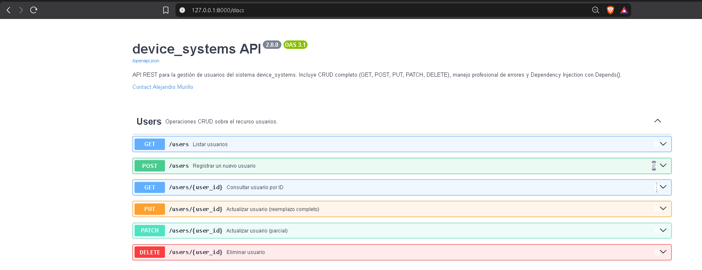

### 11.2 ReDoc
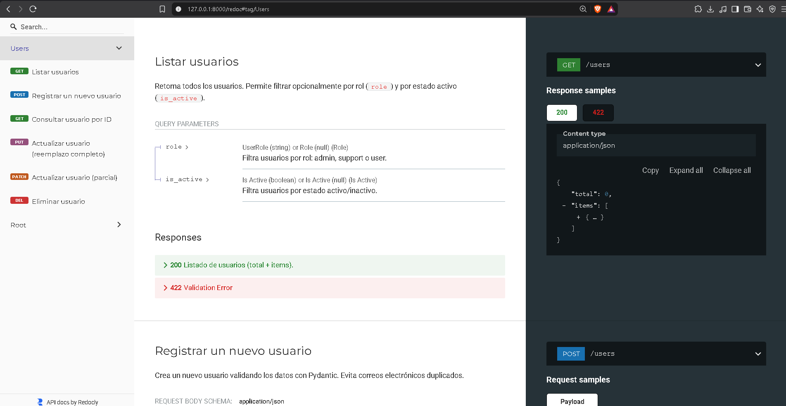

### 11.3 Evidencia GET /users y GET /users/{id}
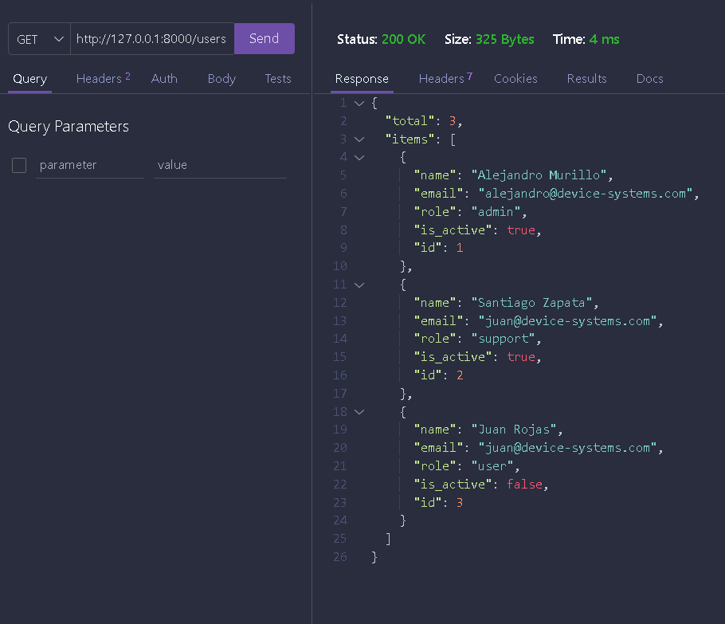
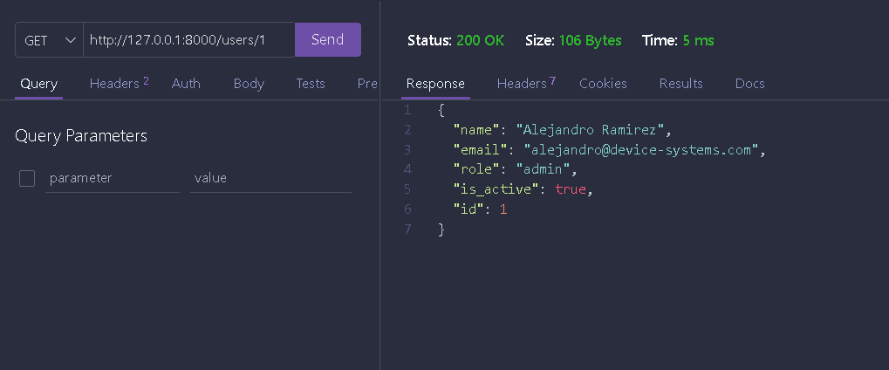


### 11.4 Evidencia POST /users


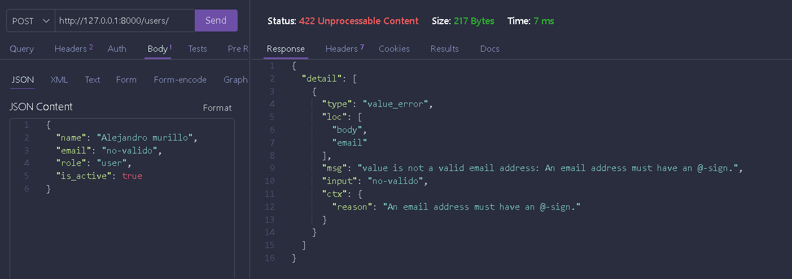
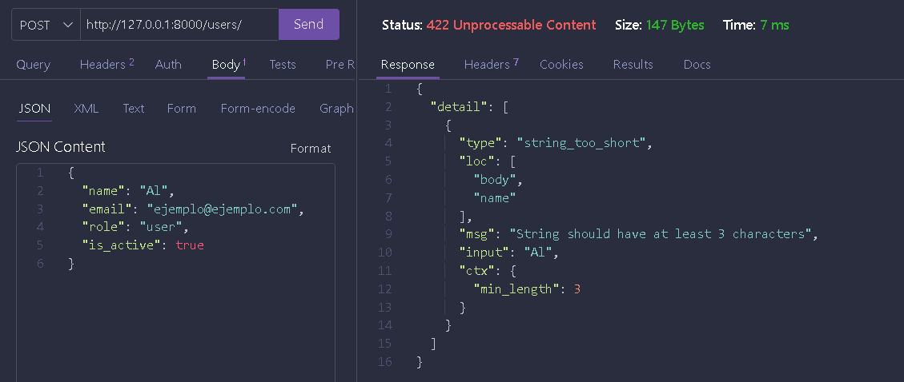

### 11.5 Evidencia PUT /users/{id}

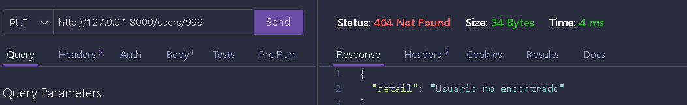

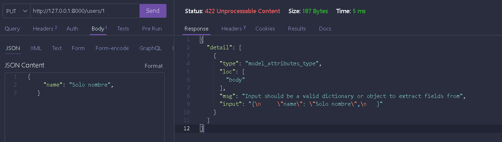

### 11.6 Evidencia PATCH /users/{id}

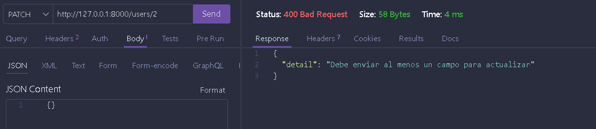
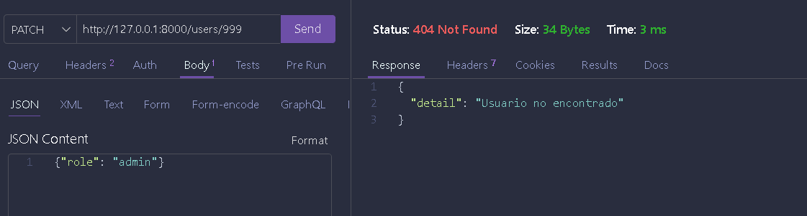

### 11.7 Evidencia DELETE /users/{id}
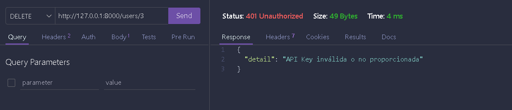


## 12. Reflexión final sobre la evolución del proyecto

Pasar de una API con solo GET y POST a una con CRUD completo obligó a organizar el código en capas: la lógica de negocio (`services`) se separó de las rutas para que cada endpoint quedara simple y legible, y las validaciones repetidas (como comprobar que un usuario exista) se centralizaron en dependencias reutilizables con `Depends()`. Esto redujo la duplicación de código entre `GET /users/{id}`, `PUT`, `PATCH` y `DELETE`, que ahora comparten la misma comprobación de existencia sin repetirla cuatro veces. Además, distinguir entre `UserUpdate` (todos los campos obligatorios) y `UserPatch` (todos opcionales) reforzó la diferencia real entre una actualización total y una parcial, en vez de simular esa diferencia con lógica manual. En conjunto, el proyecto ahora refleja mejor cómo se estructura una API REST profesional: capas separadas, errores explícitos y consistentes, y documentación que se genera junto con el código.

## 13. Autor

Proyecto desarrollado por Alejandro Murillo — Programa ADSO, Ficha 3223877, SENA CTMA.