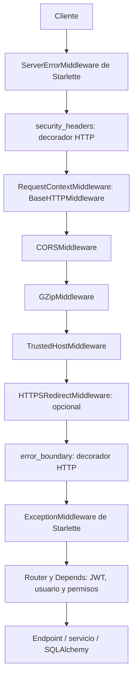
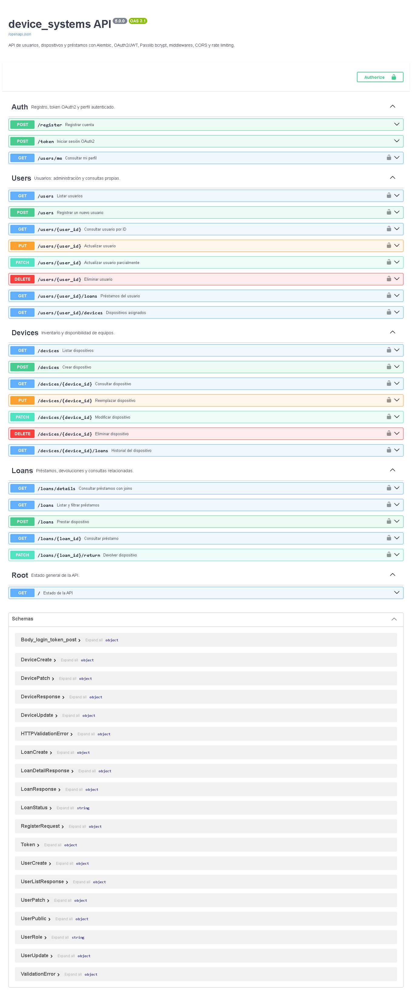
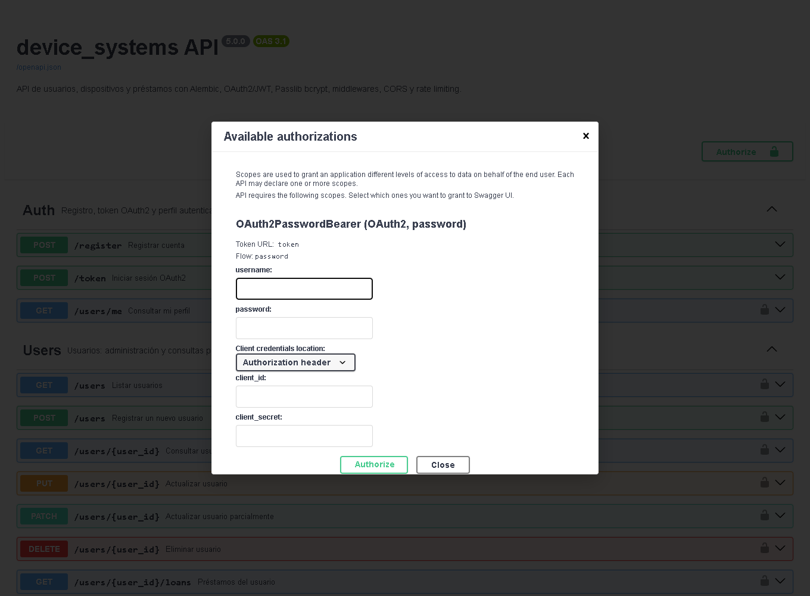
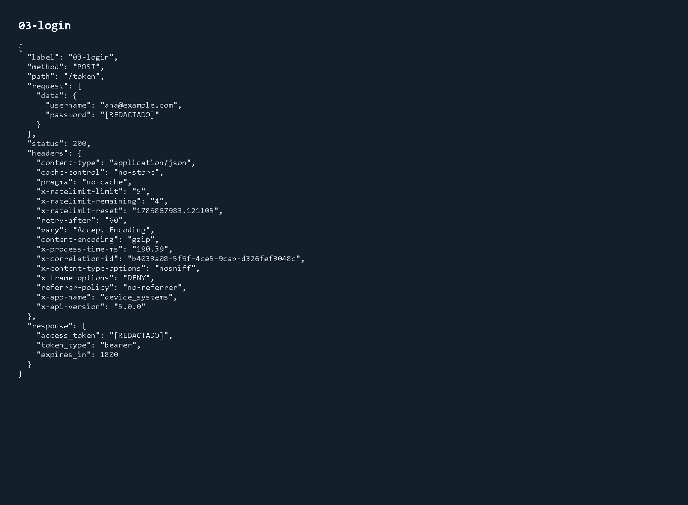
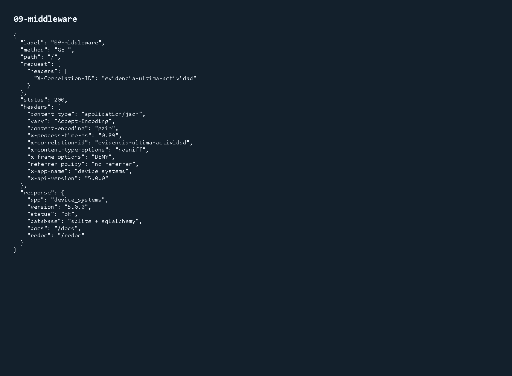
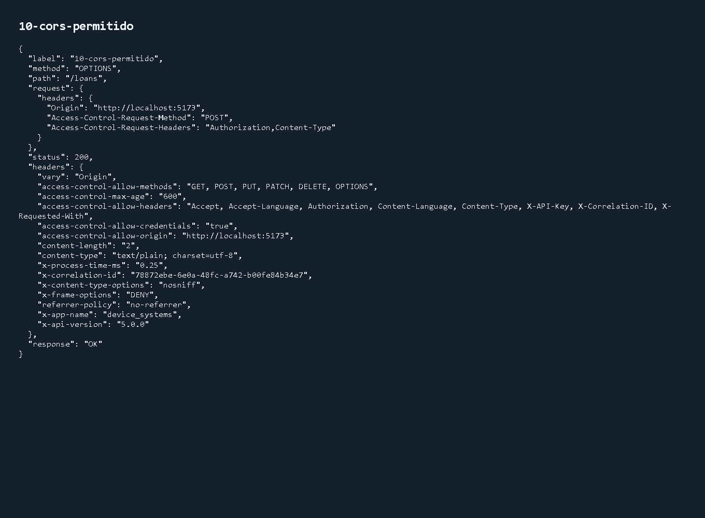
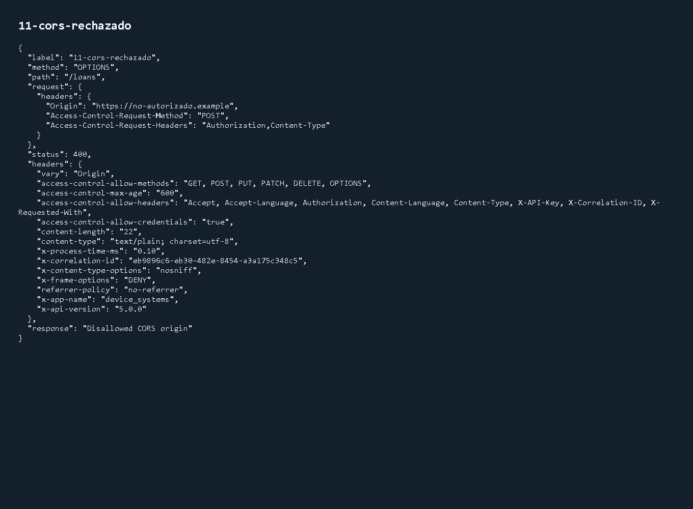
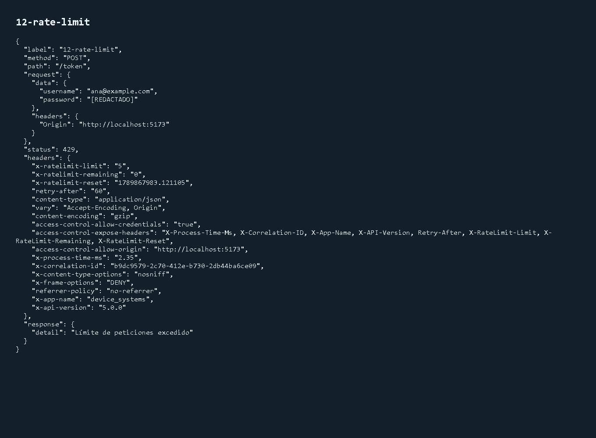

# Última actividad: middleware, CORS, validación y autenticación

Esta ampliación aplica al proyecto existente las seis lecciones recibidas: middleware, CORS, Pydantic v2, Passlib/bcrypt, OAuth2/JWT y rate limiting. Usa la base SQLite real y migraciones Alembic; no utiliza un diccionario de usuarios.

## 1. Preparación y ejecución

Desde la raíz del repositorio en PowerShell:

```powershell
.\.venv\Scripts\Activate.ps1
python -m pip install -r requirements-dev.txt
python scripts/configure_local.py
python -m alembic upgrade head
python -m app.manage create-admin --email admin@example.com --name "Administrador"
python -m uvicorn app.main:app --reload
```

Si no existe el entorno, crearlo primero con `python -m venv .venv`. El administrador se crea una vez; su contraseña se solicita sin eco y no se incluye en argumentos de consola. No hay cuentas ni contraseñas predeterminadas.

El script de configuración genera `SECRET_KEY` aleatoria de uso local y mantiene una existente. `.env` no se versiona. No compartir esta clave: quien la conoce puede firmar tokens. La API rechaza una clave ausente o menor de 32 caracteres.

### Usuarios de la actividad anterior

La revisión `0003_user_password` añade `hashed_password` nullable. Conserva usuarios, dispositivos y préstamos. Las cuentas anteriores no pueden iniciar sesión hasta asignarles una contraseña localmente:

```powershell
python -m app.manage set-password --email usuario@example.com
```

El comando no modifica rol ni estado activo. Para nuevas cuentas públicas usar `/register`; el administrador también puede usar `POST /users` con `password` opcional. Una cuenta creada sin contraseña conserva su utilidad para préstamos, pero no puede iniciar sesión.

## 2. Organización

| Archivo | Responsabilidad |
|---|---|
| `app/config.py` | Configuración validada con Pydantic v2 y variables de entorno |
| `app/security.py` | CryptContext bcrypt, hash, verificación y JWT |
| `app/middleware.py` | Logs, tiempo, correlación, cabeceras, CORS y middleware integrado |
| `app/rate_limit.py` | Un Limiter SlowAPI y respuesta 429 |
| `app/dependencies/auth_dependencies.py` | OAuth2PasswordBearer, usuario activo y permisos |
| `app/schemas/auth_schema.py` | Registro y respuesta de token |
| `app/services/auth_service.py` | Registro persistente y validación de credenciales |
| `app/routes/auth_routes.py` | `/register`, `/token`, `/users/me` |
| `app/manage.py` | Creación local de administrador y asignación de contraseñas |
| `tests/test_security.py` | Autenticación, permisos, middleware, CORS y rate limiting |

## 3. Middleware y orden

El middleware procesa peticiones y respuestas globalmente. Las dependencias de autenticación se ejecutan para las rutas que las declaran. No se intenta autenticar un preflight OPTIONS.



La respuesta recorre las mismas capas en sentido inverso. La última capa agregada con `add_middleware` o el decorador es la primera capa personalizada que recibe la petición.

| Función transversal | Comportamiento |
|---|---|
| Tiempo | `perf_counter()`, cabecera `X-Process-Time-Ms` |
| Registro | Método, ruta, estado, duración, IP y correlación; no cuerpo, query string, contraseña, cookies o Authorization |
| Correlación | Conserva `X-Correlation-ID` si contiene 1–64 letras ASCII, dígitos, puntos, guiones o guiones bajos; en otro caso genera UUID |
| Seguridad | `X-Content-Type-Options: nosniff`, `X-Frame-Options: DENY`, `Referrer-Policy: no-referrer` |
| HTTPS | HSTS solo en respuestas HTTPS; redirección opcional mediante `HTTPS_REDIRECT=true` |
| Identificación | `X-App-Name: device_systems`, `X-API-Version: 5.0.0` |
| Compresión | GZip para respuestas de al menos 1000 bytes si el cliente lo acepta |
| Host | Solo los hosts de `ALLOWED_HOSTS` |
| Errores inesperados | Respuesta JSON 500 antes de atravesar CORS; logs sin detalles privados de la excepción |

El tiempo mide hasta la obtención de las cabeceras de respuesta; no promete medir la descarga completa de una respuesta en streaming. Las pruebas verifican las cabeceras en preflights, errores de autenticación, 429 y 500.

## 4. CORS por entorno

En `.env`, las listas se escriben como JSON:

```dotenv
ENVIRONMENT=development
ALLOWED_ORIGINS=["http://localhost:3000","http://localhost:5173","http://127.0.0.1:5173"]
ALLOWED_HOSTS=["localhost","127.0.0.1","testserver"]
HTTPS_REDIRECT=false
```

Para staging o producción, definir los orígenes reales con HTTPS y los hosts de la API:

```dotenv
ENVIRONMENT=production
ALLOWED_ORIGINS=["https://app.ejemplo.com"]
ALLOWED_HOSTS=["api.ejemplo.com"]
HTTPS_REDIRECT=true
```

Estos dominios son ejemplos; reemplazarlos antes de desplegar. Configurar el proxy de confianza para comunicar correctamente el esquema HTTPS cuando termina TLS fuera de Uvicorn.

- Se usan orígenes explícitos y `allow_credentials=True`; la configuración rechaza `*`.
- Métodos: GET, POST, PUT, PATCH, DELETE y OPTIONS.
- Cabeceras de petición: Authorization, Content-Type, X-API-Key, X-Correlation-ID y X-Requested-With.
- Se exponen al frontend las cabeceras de tiempo, correlación, aplicación, Retry-After y límites.
- El navegador puede cachear el preflight durante 600 segundos.
- No se necesita regex de subdominios para este proyecto; se prefieren orígenes enumerados.

CORS controla lo que un navegador permite leer desde otro origen. No sustituye a la autenticación y no bloquea por sí solo clientes como Postman o curl. Un GET desde un origen no permitido puede devolver HTTP 200 sin `Access-Control-Allow-Origin`; el navegador no permite leerlo. El preflight rechazado devuelve 400.

Ejemplo PowerShell:

```powershell
curl.exe -i -X OPTIONS http://127.0.0.1:8000/loans -H "Origin: http://localhost:5173" -H "Access-Control-Request-Method: POST" -H "Access-Control-Request-Headers: Content-Type,Authorization"
```

Debe responder 200 con `Access-Control-Allow-Origin`, métodos y cabeceras permitidas. Con `Origin: https://no-autorizado.example`, el preflight debe devolver 400.

## 5. Pydantic v2 y contraseñas

- `ConfigDict` configura los modelos; `from_attributes=True` serializa entidades SQLAlchemy.
- `field_validator(mode="before")` elimina espacios del nombre y email antes de validar.
- La contraseña nunca se recorta: los espacios pueden formar parte de ella.
- `SecretStr` evita representaciones accidentales de la contraseña en objetos de entrada.
- Los validadores exigen al menos 8 caracteres y máximo 72 **bytes UTF-8**, sin carácter nulo, para no truncar contraseñas con bcrypt.
- `model_validator` distingue los nulos explícitos de campos omitidos en PATCH; `exclude_unset=True` conserva los campos no enviados.
- Las respuestas 422 omiten `input` y el contexto interno, de forma que no repitan contraseñas inválidas.
- Los modelos públicos nunca contienen `password`, `hashed_password` ni `internal_notes`.

`CryptContext(schemes=["bcrypt"], deprecated="auto")` centraliza el hash y la verificación. Se usan 12 rondas, salt aleatorio y rechazo de truncamiento. Dos hashes de la misma contraseña son diferentes y ambos se verifican con `verify_password()`; no se comparan hashes entre sí.

Se fija `passlib[bcrypt]==1.7.4` con `bcrypt==4.0.1`, combinación verificada en el entorno Python 3.14 de esta entrega. Las dependencias quedan explícitas para reproducir esa compatibilidad.

## 6. Registro, OAuth2 y JWT

### Registro público

`POST /register`:

```json
{"name":"Ana Perez","email":"ana@example.com","password":"ClaveEjemplo2026!"}
```

Crea una cuenta activa de rol `user` y devuelve 201 con datos públicos. No permite enviar `role`, `is_active` ni un hash. El email se normaliza y un duplicado devuelve 400.

### Login

`POST /token` recibe `application/x-www-form-urlencoded`, no JSON:

```text
username=ana@example.com
password=ClaveEjemplo2026!
```

El campo OAuth2 se llama `username`, pero en este proyecto su valor es el email. Respuesta:

```json
{"access_token":"<JWT>","token_type":"bearer","expires_in":1800}
```

La respuesta impide cachear el token mediante `Cache-Control: no-store`. Los JWT se firman con HS256 e incluyen `sub` (ID del usuario), `exp`, `iat`, `iss`, `aud` y `jti`. Se verifica la firma, el algoritmo permitido, vencimiento, emisor, audiencia y sujeto válido. El token está firmado, **no cifrado**: no contiene contraseñas ni hashes.

### Rutas protegidas

Enviar `Authorization: Bearer <JWT>` y consultar `GET /users/me`. En Swagger, pulsar **Authorize**, introducir email en `username` y contraseña; las rutas mostrarán el candado.

`OAuth2PasswordBearer` extrae el token; las funciones propias lo validan y consultan el usuario en la base. Un token ausente, modificado, vencido o de un usuario inexistente devuelve 401 con `WWW-Authenticate: Bearer`. Un usuario inactivo devuelve 403. Un email desconocido y una contraseña incorrecta usan el mismo mensaje 401.

Los roles y el estado se consultan en la base en cada petición: desactivar una cuenta o quitarle permisos afecta a tokens ya emitidos. Esta entrega usa access tokens de 30 minutos configurables; no implementa refresh tokens ni una lista de revocación. Cambiar una contraseña no revoca por sí solo un JWT ya emitido, que vence según `exp`.

### Permisos

| Operación | user | support | admin |
|---|---|---|---|
| Perfil y datos propios | Sí | Sí | Sí |
| Consultar inventario | Sí | Sí | Sí |
| Crear/modificar/eliminar dispositivos | No | Sí | Sí |
| Listar usuarios o historial de cualquier dispositivo | No | Sí | Sí |
| Crear/modificar/eliminar usuarios | No | No | Sí |
| Listar/crear/consultar/devolver préstamos | Solo propios | Todos | Todos |

DELETE de usuarios conserva también `X-API-Key` de la actividad anterior. Las reglas de disponibilidad e historial siguen aplicándose. No se permite elevar el propio rol desde una cuenta pública.

## 7. Rate limiting con SlowAPI

Se utiliza una sola instancia `Limiter` con estrategia `moving-window`:

| Endpoint | Límite | Identificación |
|---|---|---|
| POST /register | 5/minuto | IP de la conexión |
| POST /token | 5/minuto | IP de la conexión |
| GET /users/me | 30/minuto | ID del usuario ya autenticado |

El decorador de ruta está encima de `@limiter.limit`, y los endpoints reciben `request` y `response`. Para el perfil, la dependencia verifica el JWT antes de que el decorador use `request.state.user_id`. Cambiar de token no reinicia el límite del mismo usuario; usuarios diferentes mantienen contadores independientes.

Al exceder un límite se devuelve **429**, un mensaje JSON y `Retry-After` calculado por el limitador, además de las cabeceras de CORS y correlación. No se usa `hash(token)` ni se confía en un rol escrito en Authorization. Tampoco se acepta X-Forwarded-For arbitrario como identidad del cliente.

El almacenamiento por defecto `memory://` es apropiado para la demostración en un proceso y reinicia contadores al reiniciar. Con varios procesos/servidores se necesita almacenamiento compartido compatible con `limits`, por ejemplo Redis, su dependencia y `RATE_LIMIT_STORAGE_URI` correspondiente. Esto no configura ni despliega Redis automáticamente.

## 8. Pruebas y evidencias

```powershell
python -m pytest -q --junitxml=evidencias/seguridad/pytest.xml
python scripts/generate_security_evidence.py
# Capturas opcionales con Edge instalado
python -m pip install playwright
python scripts/generate_security_evidence.py --screenshots
```

Las pruebas usan bases temporales creadas con Alembic. Las de regresión ejecutan las reglas anteriores como administrador de prueba; las nuevas realizan registro y login reales sin reemplazar dependencias de autenticación.

Se verifican hashes con salt diferente, contraseñas inválidas, datos privados, tokens, permisos, estado activo, cambios de rol, cuentas antiguas, CORS permitido/rechazado, preflight sin token, cabeceras en errores, correlación, logs, GZip, Host, HTTPS y límites por IP/usuario. También se comprueba la migración y reversión de contraseñas conservando préstamos.

**Resultado: 85 pruebas aprobadas, 0 fallos, en 91.27 segundos.** Se registraron cinco avisos de deprecación procedentes de Starlette/httpx, AnyIO y SlowAPI en Python 3.14.

El reporte JUnit está en [evidencias/seguridad/pytest.xml](../evidencias/seguridad/pytest.xml). Las [respuestas completas](../evidencias/seguridad/api.json) ocultan contraseñas y tokens y se generan en una base descartable; no modifican los datos de la aplicación. También se incluyen [logs de peticiones](../evidencias/seguridad/requests.log), [historial Alembic](../evidencias/seguridad/alembic.txt) y [OpenAPI](../evidencias/seguridad/openapi.json).









## 9. Fuentes y precisiones sobre el material

- [FastAPI: OAuth2 y JWT](https://fastapi.tiangolo.com/tutorial/security/oauth2-jwt/).
- [FastAPI: CORS](https://fastapi.tiangolo.com/tutorial/cors/).
- [Passlib: bcrypt y límite de 72 bytes](https://passlib.readthedocs.io/en/stable/lib/passlib.hash.bcrypt.html).
- [SlowAPI: integración y orden de decoradores](https://slowapi.readthedocs.io/en/latest/).

Se aplicó el material al sistema existente con algunas precisiones: extraer un token no equivale a verificarlo; los JWT no cifran su contenido; bcrypt limita bytes, no caracteres; el algoritmo de rate limiting se selecciona explícitamente; y CORS no es un mecanismo de autenticación.
